Nomes e RMs,
Giovanne Charelli Zaniboni Silva | 556223
Gustavo Oliveira de Moura | 555827
Lynn Bueno Rosa | 551102

# PrevioPLS · app do consultor

App Android do **PrevioPLS**, a plataforma de retenção pós-venda do Challenge Ford (FIAP 2026). Entrega da **Sprint 3 de Mobile Development and IoT**: versão final, publicável, em APK.

No ato da compra (D0) o backend classifica o comprador em um de quatro perfis (Fiel, Abandono, Esquecido, Econômico). Quem tem risco de sair da rede oficial vira **lead** com prioridade e script de abordagem. O app é onde o consultor de serviços trabalha essa carteira: vê quem ligar primeiro, abre a visão 360 do cliente, registra o resultado do contato e acompanha a conversão.

## Download

| Arquivo | O que é |
|---|---|
| [`apk/PrevioPLS-3.0.0.apk`](apk/PrevioPLS-3.0.0.apk) | APK de release (arm64 para celular, x86_64 para emulador), com R8, assinado com a chave de upload do grupo |

Instala direto no celular (permitir apps de fonte desconhecida) ou no emulador (`adb install apk/PrevioPLS-3.0.0.apk`). O APK abre no **modo demonstração**, com servidor embutido: dá para testar todos os fluxos sem subir backend. Para usar a API de verdade, troque em **Servidor** (tela de login ou aba Perfil).

Contas (as mesmas do `DataSeeder` do backend):

| Perfil | E-mail | Senha | Pode |
|---|---|---|---|
| Consultor | `consultor@ford.com` | `cons123` | ver carteira, visão 360, registrar resultado |
| Admin | `admin@ford.com` | `admin123` | tudo do consultor + cadastrar venda D0 |
| Analista | `analista@ford.com` | `analista123` | somente leitura (carteira, visão 360, painel) |

Na tela de login há atalhos para as três contas.

## Telas

| | | |
|:-:|:-:|:-:|
| 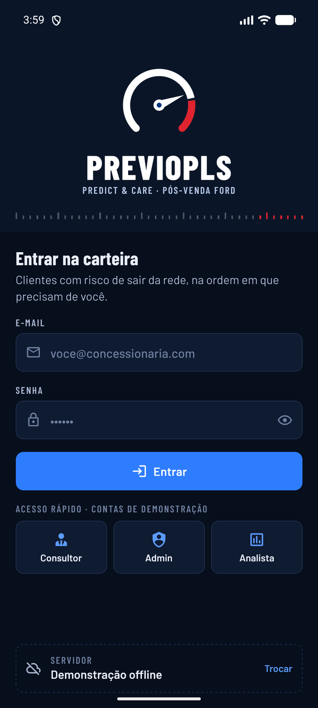 | 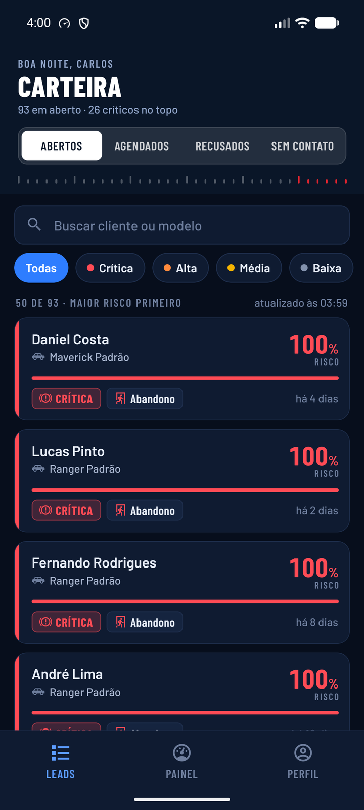 | 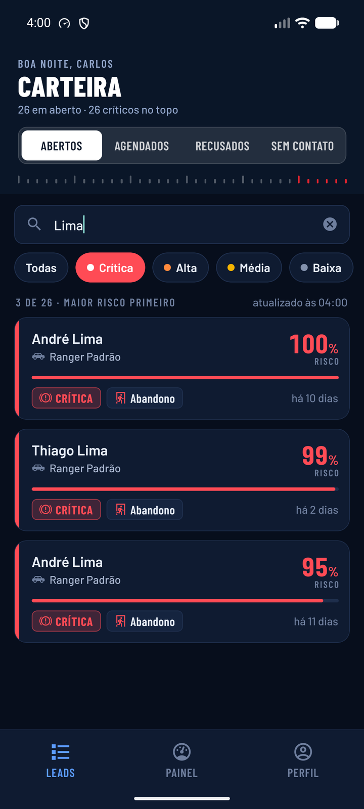 |
| **Login** · JWT, atalhos de demo, servidor | **Carteira** · maior risco primeiro | **Filtro + busca** · prioridade e nome |
| 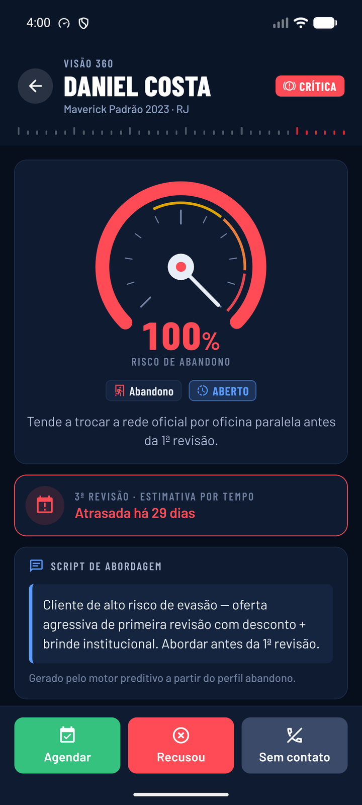 | 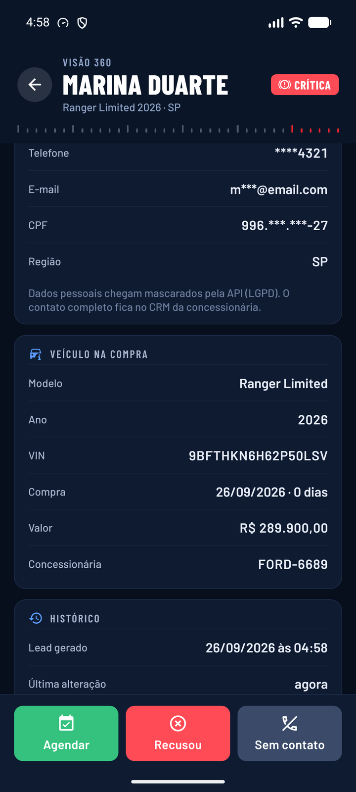 | 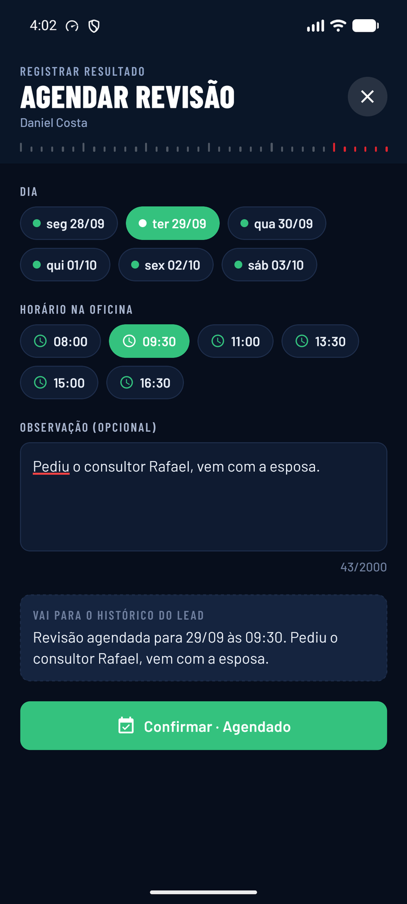 |
| **Visão 360** · conta-giros do score, revisão | **Visão 360** · cliente, veículo D0, histórico | **Registrar resultado** · dia, horário, observação |
| 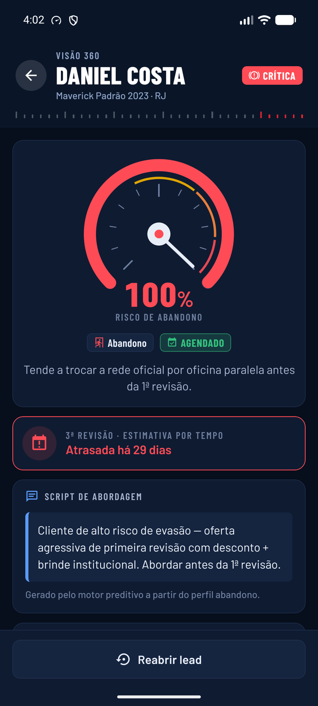 | 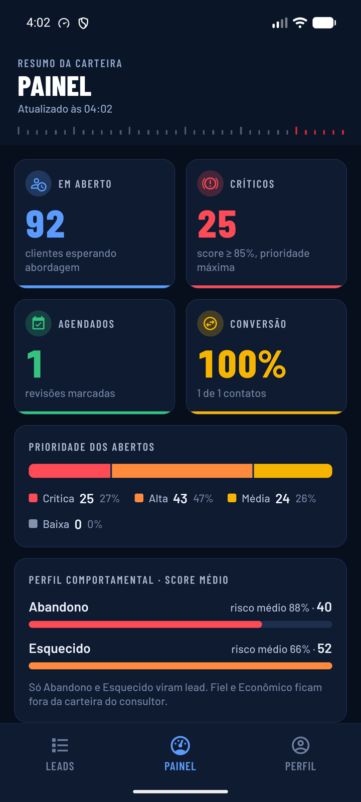 | 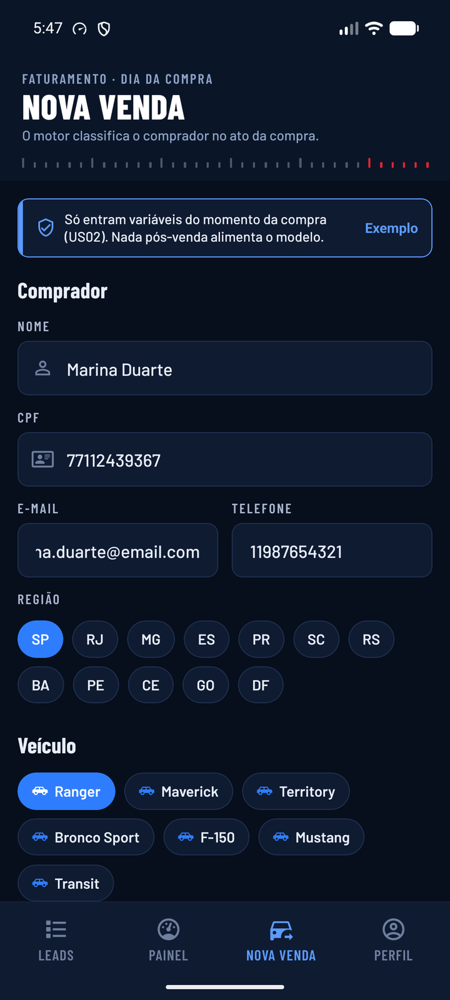 |
| **Resultado salvo** · status + toast | **Painel** · KPIs, prioridade, perfil | **Nova venda (admin)** · cadastro D0 |
| 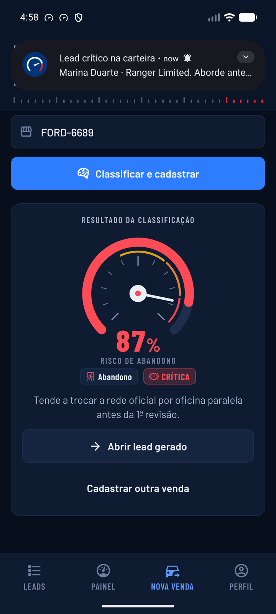 | 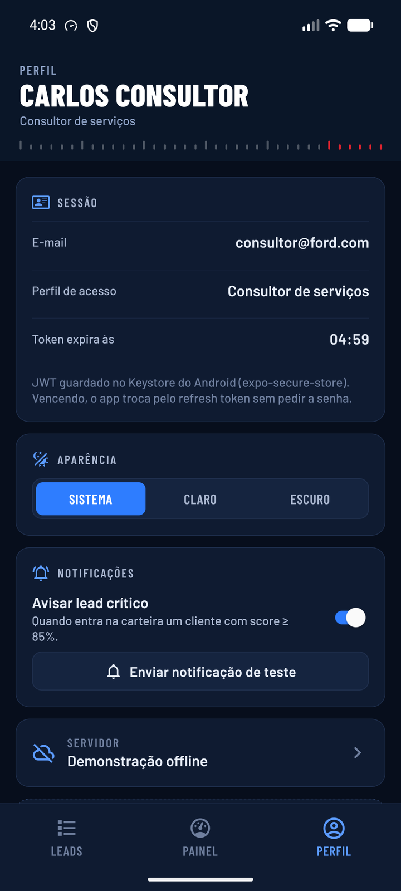 | 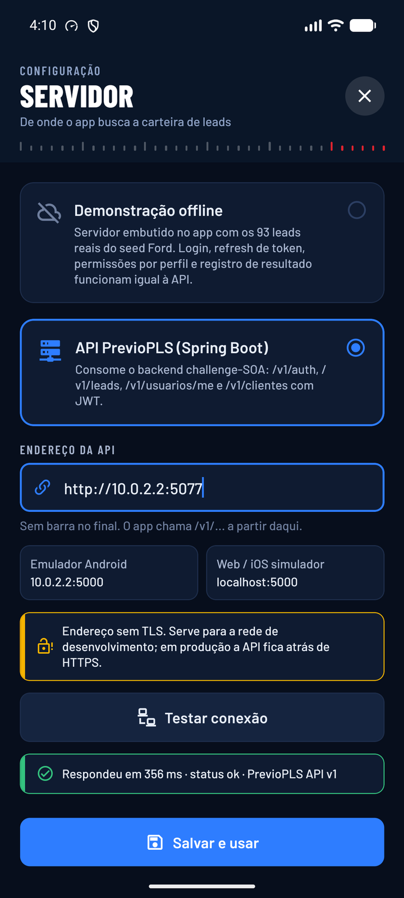 |
| **Classificação** · perfil e lead gerado | **Perfil** · sessão, tema, notificações | **Servidor** · demo ou API, teste de conexão |
| 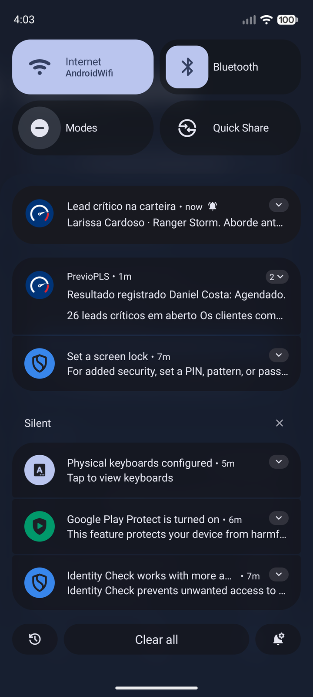 | 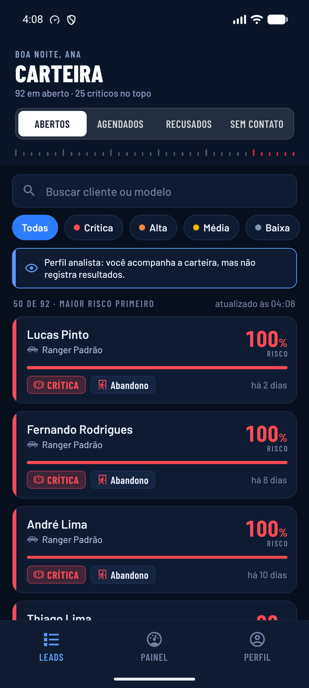 | 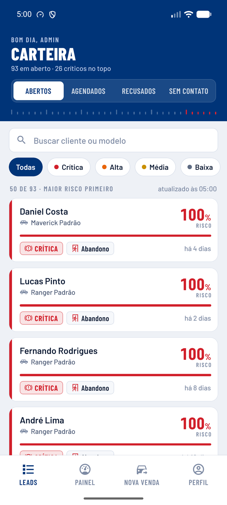 |
| **Notificação** · lead crítico chegando (o toque abre a visão 360) | **Analista** · somente leitura | **Tema claro** · mesmo sistema visual |
| 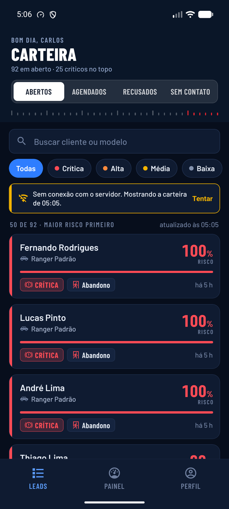 | 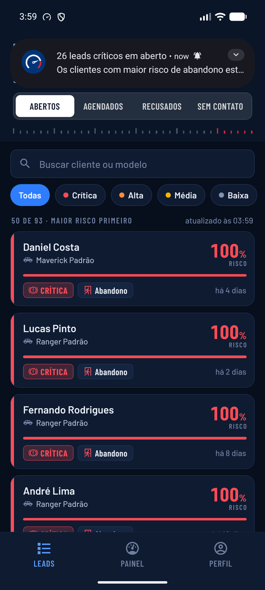 | 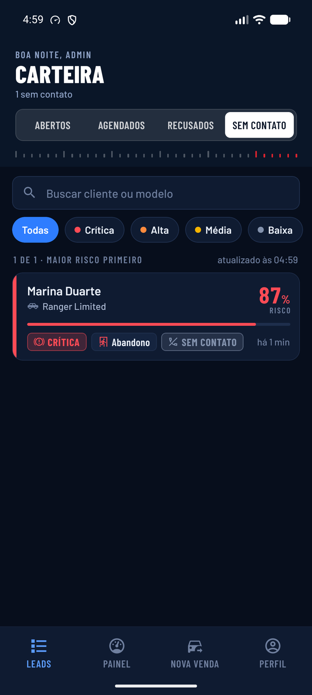 |
| **Sem conexão** · carteira continua na tela | **Primeiro acesso** · resumo dos críticos | **Aba Sem contato** · resultado registrado |

## Fluxos cobertos

| História | Fluxo no app | Onde |
|---|---|---|
| US04 · acesso seguro | login com JWT, refresh automático com rotação, logout que revoga o token, sessão no Keystore | `src/app/login.tsx`, `src/lib/api/cliente.ts`, `src/store/auth.ts` |
| US05 · carteira do dia | lista ordenada pelo backend (crítica → baixa, score desc), abas por status, filtro de prioridade, busca, paginação, pull-to-refresh, cache offline | `src/app/(app)/(tabs)/index.tsx`, `src/store/leads.ts` |
| US06 · visão 360 | score em conta-giros, perfil, próxima revisão estimada, script de abordagem, cliente (PII mascarado), veículo do D0, histórico | `src/app/(app)/lead/[id].tsx` |
| US07 · resultado do contato | agendar (dia + horário), recusou (motivo), sem contato (tentativa), reabrir; tudo vira `PATCH /v1/leads/{id}` | `src/app/(app)/registrar/[id].tsx` |
| US01 · classificação no D0 | admin cadastra a venda, o backend classifica e o app mostra perfil, score e lead gerado | `src/app/(app)/(tabs)/venda.tsx` |
| Gestão | painel com em aberto, críticos, agendados, conversão, distribuição por prioridade, perfil e resultado | `src/app/(app)/(tabs)/painel.tsx` |
| Perfis de acesso | consultor, admin e analista; a UI esconde o que o perfil não pode e o backend devolve 403 se tentar | `src/constants/dominio.ts` |
| Diferenciais | notificação local de lead crítico (toque abre a visão 360), haptics, tema claro/escuro/sistema, modo offline, modo demonstração | `src/lib/notificacoes.ts`, `src/demo/` |

## Identidade visual

A referência é o **painel de instrumentos** de um Ford: o consultor lê o risco do cliente como lê o conta-giros.

- **Cor.** Azul Ford `#003478` como âncora (faixa do topo no tema claro, botão primário), azul noite `#070E1C` no escuro, e o vermelho da faixa de risco do conta-giros `#E0242F` como cor de prioridade crítica. Alta, média e baixa seguem a escala laranja, âmbar e aço, como luzes-espia.
- **Tipografia.** Barlow Condensed (números, títulos, rótulos em caixa alta, com cara de cluster) e Barlow no texto corrido. A família nasceu da sinalização de rodovia, e aqui é o que dá o tom automotivo.
- **Assinaturas.** A régua do conta-giros fecha toda faixa de topo (os últimos traços em vermelho). O score aparece como ponteiro com mola e marcha lenta. Cada prioridade tem ícone de luz-espia (freio, motor, chave). O ícone do app é o mesmo conta-giros.
- **Sistema.** Tokens em `src/theme/tokens.ts` (cores dos dois temas, espaço, raio, escala tipográfica) e componentes base em `src/components/ui` (`Texto`, `Botao`, `Campo`, `Chip`, `Segmentado`, `Faixa`, `Aviso`, `Estado`, `Toast`). Nenhuma tela define cor ou fonte solta.

## Arquitetura

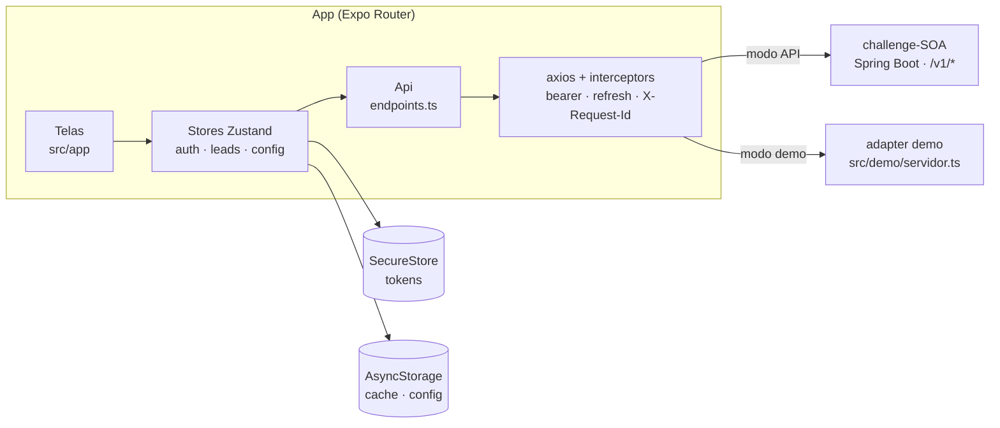

O modo demonstração é um **adapter do axios** que implementa o mesmo contrato do backend (rotas, códigos de status, envelope de erro, rotação de refresh token, RBAC, validação e até o classificador local do `MlService`, com o mesmo SHA-256). As telas, os stores e os interceptors são os mesmos nos dois modos; só o transporte muda. Os 93 leads da demo são os do seed `V3__seed_real_data.sql` do backend (`scripts/gerar-seed-demo.py`).

### Renovação de sessão

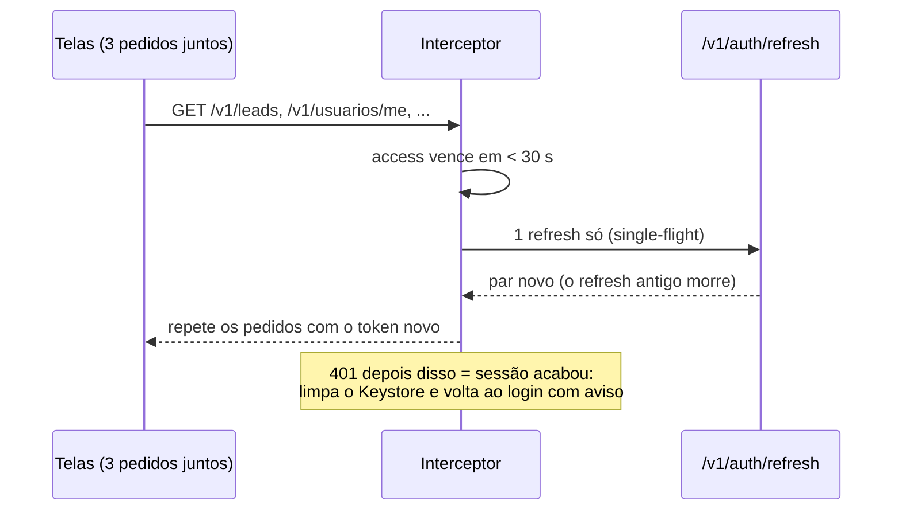

O backend rotaciona o refresh token e aceita cada um uma vez só. Dois refresh em paralelo derrubariam a sessão (o segundo recebe `TOKEN_REVOKED`), por isso o cliente segura uma promessa única de renovação.

### Estrutura

```
src/
├── app/                      rotas (Expo Router, arquivo = tela)
│   ├── _layout.tsx           fontes, splash, guards de sessão (Stack.Protected)
│   ├── login.tsx
│   ├── servidor.tsx          modal: demo x API, teste de conexão
│   └── (app)/
│       ├── (tabs)/           carteira · painel · nova venda (admin) · perfil
│       ├── lead/[id].tsx     visão 360
│       └── registrar/[id].tsx
├── components/
│   ├── ui/                   sistema visual base
│   ├── lead/                 Gauge (conta-giros), LeadCard, Tags, Secao
│   └── painel/               Kpi, barras
├── demo/                     servidor embutido + seed.json
├── lib/
│   ├── api/                  cliente axios, endpoints, normalização de erro
│   ├── sessao.ts · storage.ts · jwt.ts · notificacoes.ts · formato.ts
├── store/                    auth, leads, config (Zustand)
├── theme/                    tokens e useTema
└── types/api.ts              contrato do challenge-SOA
```

## API consumida

Backend: [challenge-SOA](https://github.com/Lynnbrosa/challenge-SOA) (Java 21, Spring Boot 3, JWT HS256).

| Método | Rota | Uso no app |
|---|---|---|
| POST | `/v1/auth/login` | entrar |
| POST | `/v1/auth/refresh` | renovar sessão (automático) |
| POST | `/v1/auth/logout` | sair (revoga access e refresh) |
| GET | `/v1/usuarios/me` | nome e validade do token no Perfil |
| GET | `/v1/leads?status=&prioridade=&page=&per_page=` | carteira, contagens do painel |
| GET | `/v1/leads/{id}` | visão 360 |
| PATCH | `/v1/leads/{id}` | registrar resultado / reabrir |
| POST | `/v1/clientes` | nova venda D0 (admin) |
| GET | `/health`, `/version` | teste de conexão na tela Servidor |

Erros chegam no envelope `{"error":{"code","message","details"}}` e viram mensagem legível em `src/lib/api/erros.ts` (sem conexão, timeout, 401, 403, 409, 422 por campo, 429).

## Segurança no app

- Tokens no **Keystore do Android** via `expo-secure-store` (`WHEN_UNLOCKED_THIS_DEVICE_ONLY`), nunca no AsyncStorage. O backup do Android exclui o secure store.
- Sessão presa ao servidor: token emitido pela demo não é enviado à API real e vice-versa; trocar de servidor desloga.
- Refresh com rotação e promessa única; 401 depois do refresh limpa tudo.
- PII chega mascarado da API (CPF, e-mail, telefone) e o app não tenta desmascarar. A observação volta do backend passada pelo encoder OWASP; o app só decodifica as entidades para exibir.
- Permissões mínimas: notificações e vibração. Microfone, overlay e storage externo bloqueados no manifest.
- Release com R8 (minify + shrink de recursos). HTTP sem TLS fica liberado só porque a API de desenvolvimento roda em `http://`; a tela Servidor avisa quando o endereço não tem TLS.

## Rodar em desenvolvimento

Pré-requisitos: Node 20+, Android Studio (SDK 36) com um emulador, JDK 17 ou 21.

```bash
npm install
npx expo run:android      # build de debug no emulador/celular
npx expo start --web      # só para olhar layout no navegador
```

No Windows, clone o projeto num caminho curto (ex.: `C:\dev\previopls-mobile`) antes do `run:android`; veja o motivo em [Gerar o APK](#local-gradle).

Para apontar para a API desde o build, copie `.env.example` para `.env` e preencha `EXPO_PUBLIC_API_URL` (emulador: `http://10.0.2.2:5000`; celular na mesma rede: `http://<ip-da-máquina>:5000`). Sem essa variável o app abre no modo demonstração. O endereço também pode ser trocado dentro do app.

Backend local:

```bash
git clone https://github.com/Lynnbrosa/challenge-SOA
cd challenge-SOA && mvn spring-boot:run   # PostgreSQL local, porta 5000
```

## Gerar o APK

### EAS Build (nuvem)

```bash
npm install -g eas-cli
eas login
eas build -p android --profile preview      # APK
eas build -p android --profile production   # AAB para a Play Store
```

Os perfis estão em `eas.json`. O `preview-api` embute `EXPO_PUBLIC_API_URL`.

### Local (Gradle)

```bash
npx expo prebuild -p android
cd android && ./gradlew assembleRelease
```

O APK sai em `android/app/build/outputs/apk/release/app-release.apk`. Com `PREVIOPLS_UPLOAD_STORE_FILE`, `PREVIOPLS_UPLOAD_STORE_PASSWORD`, `PREVIOPLS_UPLOAD_KEY_ALIAS` e `PREVIOPLS_UPLOAD_KEY_PASSWORD` no `~/.gradle/gradle.properties`, o plugin `plugins/with-release-signing.js` assina com a upload key; sem elas, assina com a chave de debug. A chave (`.jks`) e a senha ficam fora do repositório, com quem publica o app.

**No Windows**, o CMake do `react-native-gesture-handler` gera caminhos acima de 260 caracteres quando o projeto está numa pasta funda (ex.: Desktop) e o ninja para com `Filename longer than 260 characters`. O script `npm run build:apk:local` copia o projeto para `C:\pm`, compila lá e traz o APK para `dist-apk/`.

## Testes

```bash
npm test           # jest (28 testes)
npm run typecheck  # tsc --noEmit, TypeScript estrito
```

- `__tests__/servidor-demo.test.ts`: o servidor demo responde como o challenge-SOA (401/403/404/409/422, envelope de erro, lockout após 5 falhas, rotação e revogação de token, ordenação e paginação, classificação D0 igual ao `MlService`).
- `__tests__/sessao-refresh.test.ts`: três requisições com token vencido geram **um** refresh; 401 no meio do uso renova e repete; logout no servidor derruba a sessão local.
- `__tests__/formato.test.ts`: datas `LocalDate` sem erro de fuso, moeda, revisão estimada, cortes de prioridade.

## Solução de problemas

- **"Sem conexão com o servidor"** no modo API: confira `/health` no navegador do celular, o endereço em Servidor (emulador usa `10.0.2.2`) e o firewall da porta 5000.
- **Notificação não aparece**: Android 13+ pede permissão na primeira abertura; se negou, libere em Configurações › Apps › PrevioPLS › Notificações. Teste em Perfil › Enviar notificação de teste.
- **Quero a demo zerada**: Perfil › Restaurar dados da demonstração.
